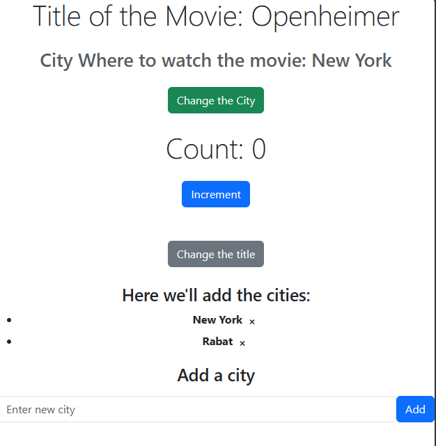
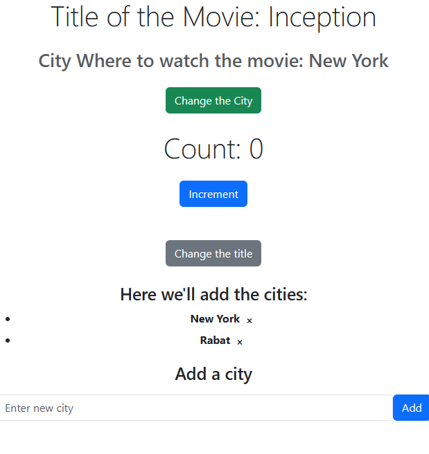
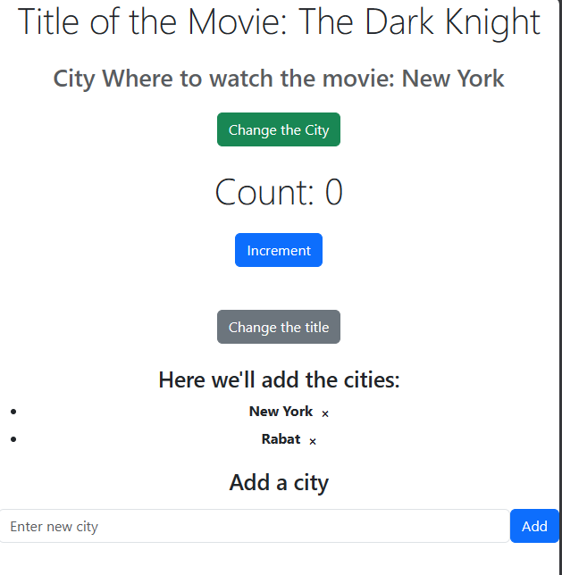
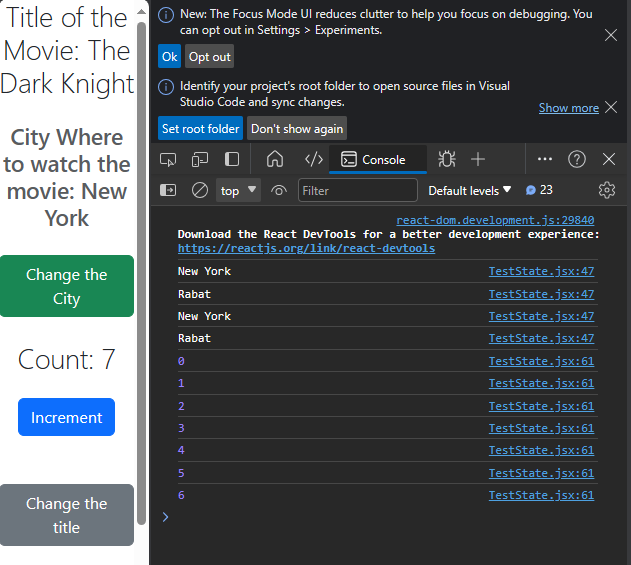
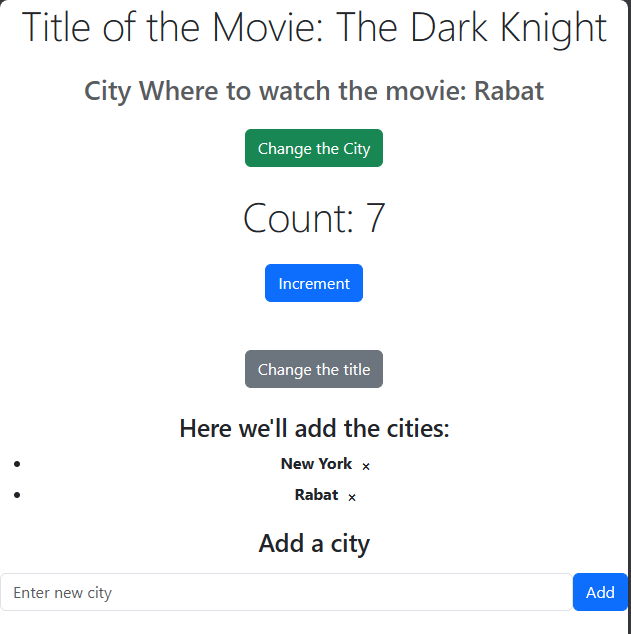
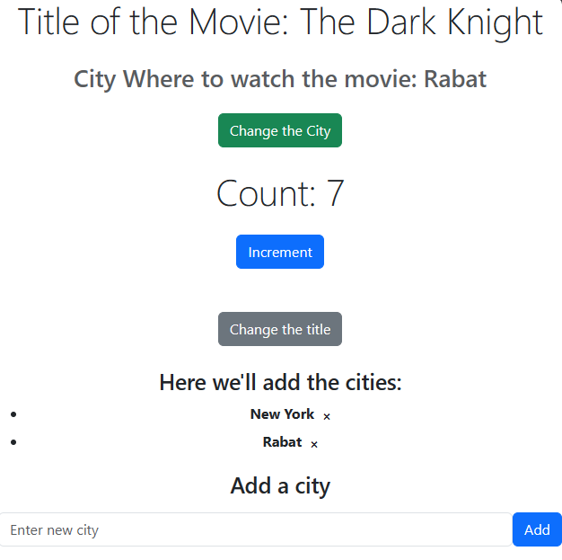
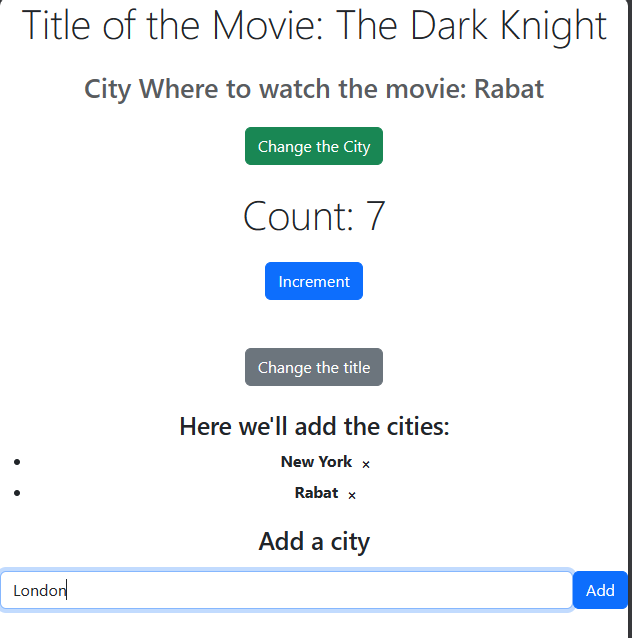
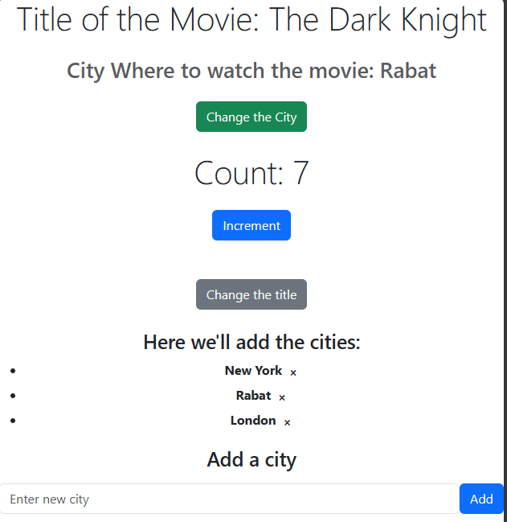
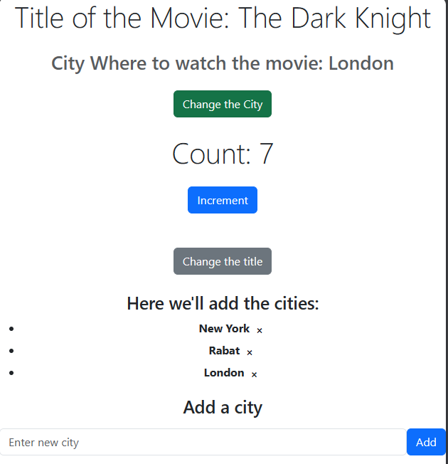

# Overview About the App:
This React application serves as a practical introduction to the fundamental concepts of ReactJS, with a specific focus on understanding and utilizing the `useState` hook. The app demonstrates various functionalities that involve manipulating state variables, handling user interactions, and dynamically updating the UI.

## Functionalities of the App:

### 1. Count Manipulation:
   - The app features a counter displayed prominently on the page.
   - Clicking the "Increment" button increases the count, showcasing the use of the `useState` hook to manage and update state.

### 2. Movie Title Rotation:
   - The application displays the title of a movie, initially set to "Openheimer."
   - Clicking the "Change the title" button rotates through a list of predefined movie titles, demonstrating how to use state to dynamically update content.

### 3. City Selection:
   - The app allows users to select a city from a list.
   - Clicking the "Change the City" button rotates through a list of cities where the movie can be watched, illustrating the dynamic rendering of city names based on state changes.

### 4. City List Management:
   - The app maintains a list of cities where the movie is available.
   - Users can add new cities to the list by entering the city name in the input field and clicking the "Add" button.
   - Each city in the list can be deleted individually by clicking the corresponding "Delete" button.

### 5. Deletion of a City:
   To delete a city from the list:
   - Locate the city in the displayed list.
   - Click the "Delete" button (represented by "✖") next to the city name.
   - The city will be removed from the list.

# App in Use: 

- Here we have the interface of the App:
  

- Now let's start with the Title of the movie:
  
- After clicking the "Change the title" button, we get another film title dynamically updated from an array.
  
- Now let's check the count functionality:
  
- Clicking "Increment" dynamically increases the count.
   
- Now let's move to the "Change the city" button.
  
- The button dynamically displays the cities based on the available list.
   
- Now we have an "Add" button to add another city, let's add "London," for example:
  
- The added city is displayed in the list:
  
- We can then change the city to our newly added one:
  

### Happy Coding.
